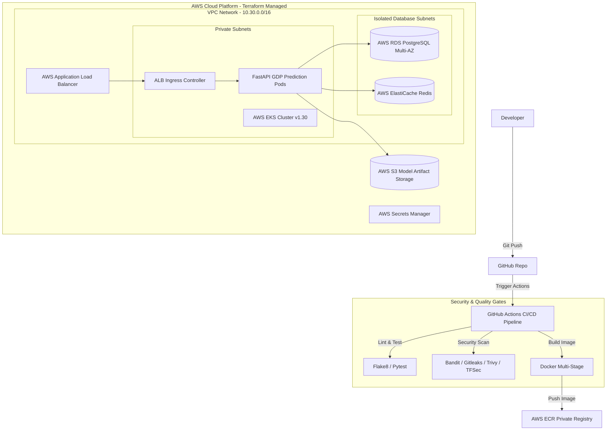

# 📈 National GDP Prediction Platform — Production Infrastructure & CI/CD Platform

Production-grade cloud platform, containerization, Infrastructure as Code (Terraform), Kubernetes (AWS EKS), GitOps (Argo CD), and DevSecOps CI/CD pipeline for the **National GDP Prediction Engine** (ARIMA + Deep Learning Hybrid Models).

---

## 🏛️ Architecture Overview



---

## 📂 Repository Structure

```text
.
├── bootstrap/                           # Safe 2-Step Terraform State Bootstrap (S3 + DynamoDB)
│   ├── main.tf
│   ├── variables.tf
│   └── outputs.tf
│
├── aws/                                 # AWS Cloud Infrastructure Resources
│   ├── vpc.tf                           # 3-AZ VPC, Subnets, NAT, IGW, Route Tables
│   ├── eks.tf                           # EKS Cluster v1.30, Node Groups & OIDC Provider
│   ├── ecr.tf                           # Immutable ECR Registry with scan-on-push
│   ├── rds.tf                           # PostgreSQL Multi-AZ DB Cluster
│   ├── redis.tf                         # ElastiCache Redis Replication Group
│   ├── iam.tf                           # EKS Cluster & Worker Node IAM Roles
│   ├── secrets.tf                       # AWS Secrets Manager Secret & Versions
│   ├── dns.tf                           # Route 53 Hosted Zone
│   ├── acm.tf                           # ACM TLS Certificate with DNS Validation
│   └── monitoring.tf                    # CloudWatch Log Groups for EKS & Application
│
├── kubernetes/                          # Kubernetes Platform Resources
│   ├── namespace.tf                     # Namespace resource
│   ├── serviceaccount.tf                # EKS IRSA ServiceAccount
│   ├── rbac.tf                          # Role & RoleBinding
│   ├── configmap.tf                     # Environment ConfigMap
│   ├── deployment.tf                    # Rolling Update Deployment & SecurityContext
│   ├── service.tf                       # ClusterIP Service
│   ├── ingress.tf                       # AWS Load Balancer Controller Ingress
│   ├── hpa.tf                           # Horizontal Pod Autoscaler (2-15 pods)
│   ├── pdb.tf                           # Pod Disruption Budget
│   └── networkpolicy.tf                 # Network Policy Isolation
│
├── github/                              # GitHub Platform & OIDC Integration
│   ├── repository.tf                    # Repository settings
│   ├── environments.tf                  # Dev, Staging, Production environments
│   ├── branch_protection.tf             # Main branch protection rules
│   ├── secrets.tf                       # Actions Secrets
│   └── oidc.tf                          # AWS IAM OIDC Provider & Roles
│
├── ci-cd/                               # GitHub Actions Workflow Templates
│   ├── ci.yml                           # Lint, Pytest, SAST & Docker Scan
│   ├── deploy-dev.yml                   # DEV Deployment
│   ├── deploy-staging.yml               # STAGING Deployment
│   └── deploy-production.yml            # PRODUCTION Deployment with Approval Gate
│
├── src/                                 # Production FastAPI Machine Learning Backend
│   ├── app/
│   │   ├── api/                         # /health, /ready, /metrics, /predict, /forecast
│   │   ├── core/                        # Settings & Structured JSON Logging
│   │   ├── db/                          # Async PostgreSQL & Redis Clients
│   │   ├── models/                      # ARIMA-LSTM/GRU/CNN Hybrid ML Engine
│   │   └── main.py                      # FastAPI Server Entrypoint
│   └── data/GDP.csv                     # Historical GDP Dataset
│
├── tests/                               # Pytest Unit & Integration Test Suite
├── Dockerfile                           # Security-Hardened Multi-Stage Dockerfile
├── docker-compose.yml                   # Local Development Environment
├── helm/                                # Production Kubernetes Helm Chart
│   └── gdp-prediction-app/
├── gitops/                              # Argo CD App-of-Apps GitOps Manifests
├── monitoring/                          # Prometheus Alert Rules & Grafana Dashboard
├── scripts/                             # Smoke Test, Health Check & DR Automation Scripts
├── docs/                                # Architecture, DR, Secrets & Troubleshooting Runbooks
├── Makefile                             # Developer CLI Command Automation
└── terraform.tfvars.example             # Example Terraform Variables Template
```

---

## ⚡ Quick Start & Local Development

### 1. Run Local Stack
Spin up FastAPI, PostgreSQL, Redis, Prometheus, and Grafana:
```bash
make docker-up
```
- **API Documentation**: [http://localhost:8000/docs](http://localhost:8000/docs)
- **Health Endpoint**: [http://localhost:8000/health](http://localhost:8000/health)
- **Prometheus Metrics**: [http://localhost:8000/metrics](http://localhost:8000/metrics)
- **Grafana Dashboard**: [http://localhost:3000](http://localhost:3000) (`admin` / `admin`)

### 2. Run Test Suite & Linters
```bash
make test
make lint
```

---

## 🚀 Cloud Provisioning with Terraform

### Step 1: Bootstrap Remote State (S3 + DynamoDB)
```bash
make bootstrap
```

### Step 2: Provision Complete AWS & Kubernetes Infrastructure
```bash
cp terraform.tfvars.example terraform.tfvars
make init
make plan
make apply
```

---

## 🛡️ Security & DevSecOps Controls
- **Non-Root Containers**: Runs as UID `10001` (`appuser`) with read-only root filesystem.
- **Zero Long-Lived AWS Keys**: Uses AWS OpenID Connect (OIDC) federated authentication for GitHub Actions.
- **Automated Security Gates**: Gitleaks secret detection, Bandit SAST, Trivy container scanning, TFSec Terraform scanning.
- **Network Isolation**: Private subnets for EKS Nodes, RDS PostgreSQL, and ElastiCache Redis.
