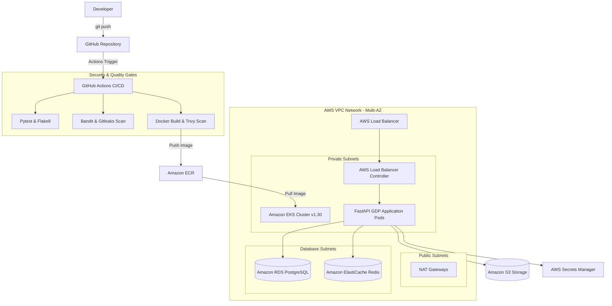

# Architecture Overview — National GDP Prediction Platform

The National GDP Prediction Platform is a cloud-native, microservices-based machine learning prediction engine deployed on AWS EKS using Infrastructure as Code (Terraform).

## System Components
1. **Application Backend**: Python 3.11 FastAPI serving ARIMA + LSTM/GRU/CNN Hybrid GDP predictions.
2. **Infrastructure**: Provisioned via Terraform (`aws/`, `kubernetes/`, `github/`, `bootstrap/`).
3. **Database**: Managed AWS RDS PostgreSQL Multi-AZ cluster.
4. **Cache**: Managed AWS ElastiCache Redis cluster.
5. **Storage**: Amazon S3 bucket for model checkpoint storage.
