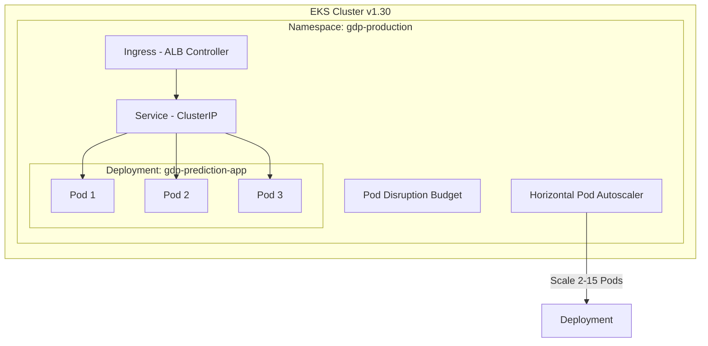

# Kubernetes Cluster & Workload Architecture

## Key Workload Policies
- **HPA**: Auto-scales based on 75% CPU and 80% Memory targets.
- **PDB**: Maintains `minAvailable: 2` replicas during node rotation.
- **SecurityContext**: Non-root UID `10001`, read-only root filesystem, capabilities dropped.
