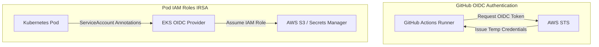

# DevSecOps & Security Architecture

## Security Posture
- **Zero Static Credentials**: OIDC eliminates long-lived AWS IAM access keys in CI/CD.
- **IRSA**: Pods assume least-privilege IAM roles dynamically.
- **Scans**: Gitleaks (Secrets), Bandit (SAST), Trivy (Containers), TFSec (Terraform).
